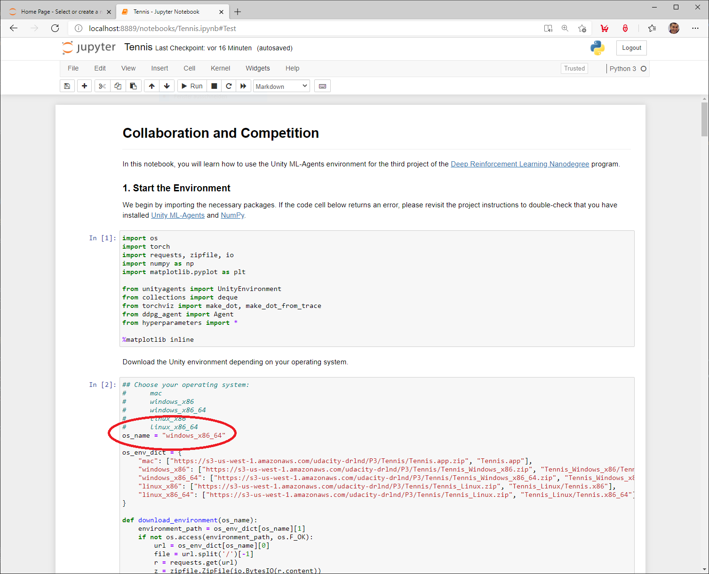

[//]: # (Image References)

[image1]: /resources/sample-match.gif


# Project 3: Collaboration and Competition

### Introduction

For this project, you will work with the [Tennis](https://github.com/Unity-Technologies/ml-agents/blob/master/docs/Learning-Environment-Examples.md#tennis) environment.

![Trained Agent][image1]

In this environment, two agents control rackets to bounce a ball over a net. If an agent hits the ball over the net, it receives a reward of +0.1.  If an agent lets a ball hit the ground or hits the ball out of bounds, it receives a reward of -0.01.  Thus, the goal of each agent is to keep the ball in play.

The observation space consists of 8 variables corresponding to the position and velocity of the ball and racket. Each agent receives its own, local observation.  Two continuous actions are available, corresponding to movement toward (or away from) the net, and jumping. 

The task is episodic, and in order to solve the environment, your agents must get an average score of +0.5 (over 100 consecutive episodes, after taking the maximum over both agents). Specifically,

- After each episode, we add up the rewards that each agent received (without discounting), to get a score for each agent. This yields 2 (potentially different) scores. We then take the maximum of these 2 scores.
- This yields a single **score** for each episode.

The environment is considered solved, when the average (over 100 episodes) of those **scores** is at least +0.5.

## Files included in this repository

The code used to create, train and evaluate the agents:

|File                                     |Description                                       |
|:----------------------------------------|:-------------------------------------------------|
|[Tennis.ipynb](Tennis.ipynb)             |Jupyter notebook to train and evaluate the agent  |
|[ddpg_agent.py](ddpg_agent.py)           |Implementation of the DDPG agent                  |
|[model.py](model.py)                     |Network architecture used by the DDPG agent       |
|[ou_noise.py](ou_noise.py)               |Implemetation of the Ornstein-Uhlenbeck noise     |
|[replay_buffer.py](replay_buffer.py)     |Replay buffer implementation                      |
|[hyperparameters.py](hyperparameters.py) |Hyperparameter settings                           |
|[drlnd.txt](drlnd.txt)                   |Conda environment file                            |

Documentation:

|File                                                         |Description                                                        |
|:------------------------------------------------------------|:------------------------------------------------------------------|
|[Report.md](Report.md)                                       |Description of the development process and the learning algorithm  |
|README.md                                                    |This README.md file                                                |

The trained models:

|File                      |Description                              |
|:-------------------------|:----------------------------------------|
|model/agent_1_actor.pth   |Weights of the Actor Network of Agent 1  |
|model/agent_1_critic.pth  |Weights of the Critic Network of Agent 1 |
|model/agent_2_actor.pth   |Weights of the Actor Network of Agent 2  |
|model/agent_2_critic.pth  |Weights of the Critic Network of Agent 2 |

## Environment Setup

This section describes how to get the code for this project and how to set up the environment.

### Getting the code

First create a project directory and change to this directory.

Run the following command to clone this repository using GIT

```
$ git clone https://github.com/aboerzel/udacity-deep-reinforcement-learning-p3-collab-compet.git
```

### Create the environment
The `drlnd.txt` file included in this repository describes all the packages required to set up a [Conda](https://docs.conda.io/projects/conda/en/latest/index.html) environment.
If you haven't installed Conda, download the [Conda installer](https://www.anaconda.com/distribution/) and follow the [installation instructions](https://docs.anaconda.com/anaconda/install/).

Run the following commands to create the environment, this will create an environment named `drlnd`.

```
$ conda create --name drlnd --file drlnd.txt
$ conda activate drlnd  
```

## Train and evaluate the Agent

Activate the `drlnd` environment and start the Jupyter Notebook server by running the commands below. A new browser tab will open with a list of the files in the current folder.

```
$ conda activate drlnd
$ jupyter notebook
```

Click on the [Tennis.ipynb](Tennis.ipynb) notebook to open it.  

  

First set the variable `os_name` according to your operating system before you run the notebook cells so that the appropriate Unity environment will be downloaded.

Available options:

* mac (Mac OSX)
* windows_x86 (Windows 32-bit)
* windows_x86_64 (Windows 64-bit)
* linux_x86 (Linux 32-bit)
* linux_x86_64 (Linux 64-bit) 


Then execute the notebook cells one after the other with the key combination **SHIFT + ENTER**, starting with cell **1**.

In order to evaluate the agents only with the pre-trained weights, the cells for the training can be skipped. 
The cells for visualizing the network architecture can also be skipped. 
Corresponding information can be found in the comments in the Jupiter Notebook.

