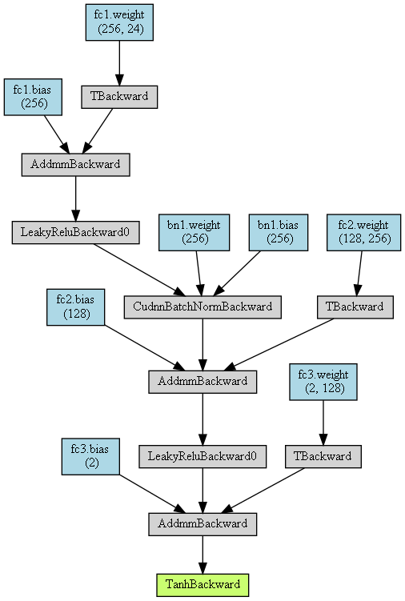
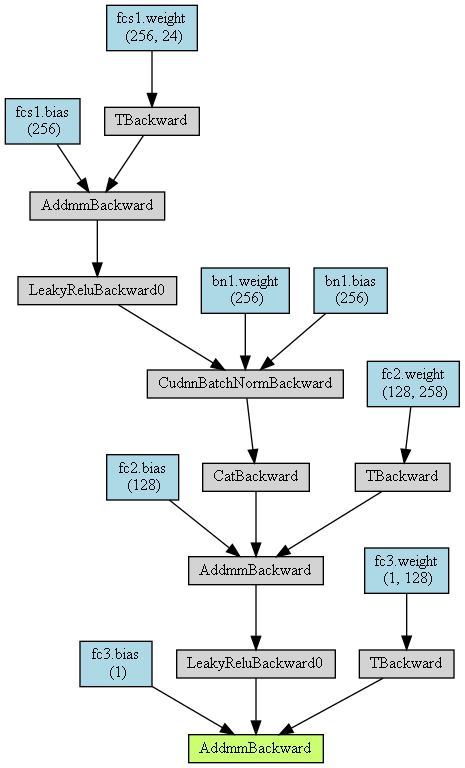
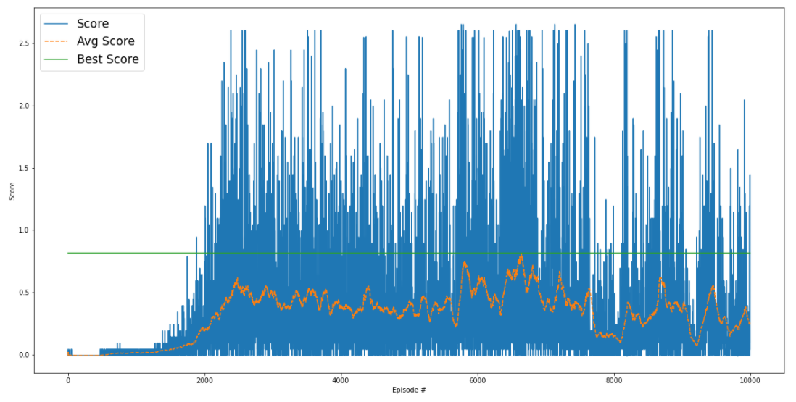
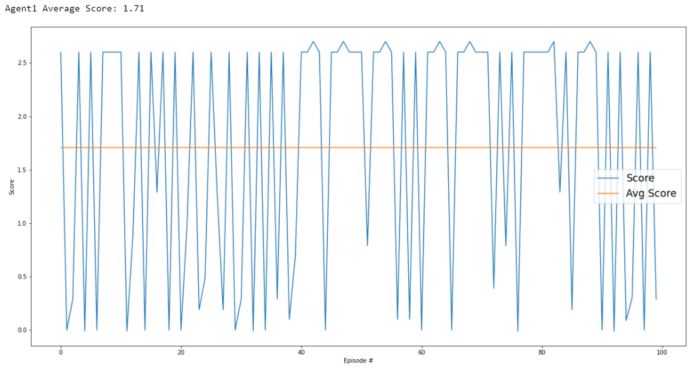
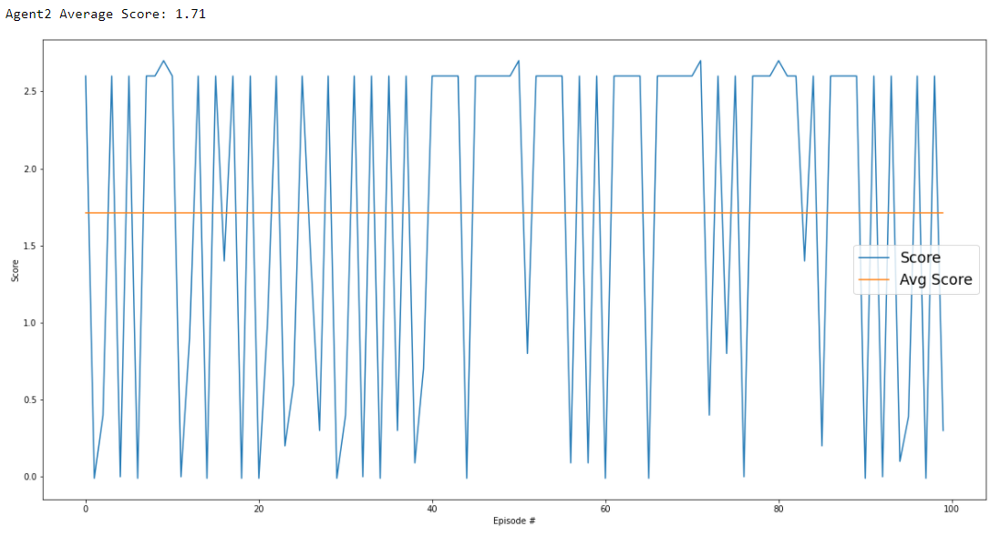

# Udacity Deep Reinforcement Learning Nanodegree - Project 3: Collaboration and Competition

## Description of the implementation

### Method

#### Analysis of the problem

In tennis, 2 players play against each other, i.e. 2 agents are required, each representing one of the two players. 

The [Tennis](https://github.com/Unity-Technologies/ml-agents/blob/master/docs/Learning-Environment-Examples.md#tennis) environment uses two continuous actions:
- Horizontal movement of the racket away from or towards the net
- Vertical movement of the racket (jump)

**Conclusion:** We are dealing here with a **multiple agent** environment with a **continuous action space**.

To solve the Tennis environment, I used the [Multi-Agent Deep Deterministic Policy Gradient (MADDPG)](https://papers.nips.cc/paper/2017/file/68a9750337a418a86fe06c1991a1d64c-Paper.pdf) algorithm, as discussed in Lesson 2. 

#### Steps

1. I started with the [DDPG agent](https://arxiv.org/pdf/1509.02971.pdf) implementation from the previous [Continuous Control](https://github.com/aboerzel/udacity-deep-reinforcement-learning-p2-continuous-control) project. 
   Here I moved the implementations of the [Ornstein-Uhlenbeck noise](https://arxiv.org/pdf/1702.00032.pdf), the [Experience Replay](https://paperswithcode.com/method/experience-replay) as well as the hyperparameters to separate files, for better reuse.

2. Next I implemented the multiple agent training loop in the [Tennis.ipynb](Tennis.ipynb) jupyter notebook, using two DDPG agents.

3. In the next step I made small adjustments to the network architecture. Here the size of the hidden layers has been adjusted.
   

4. Then I adjusted some of the hyperparameters. 

5. Most recently, I evaluated that the trained agents achieved at least the required score. 

### Network Architecture

##### Actor Network Architecture

- Input layer with 24 nodes for the states corresponding to the position and velocity of the ball and racket
- First Fully-Connected layer with 256 nodes
- [Batch Normlization](https://arxiv.org/pdf/1502.03167.pdf) layer
- Second Fully-Connected layer with 128 nodes
- Output layer with 2 nodes for the possible actions corresponding to movement toward (or away from) the net, and jumping

 

##### Critic Network Architecture

- Input layer with 24 nodes for the states corresponding to the position and velocity of the ball and racket
- First Fully-Connected layer with 256 nodes
- [Batch Normlization](https://arxiv.org/pdf/1502.03167.pdf) layer
- Second Fully-Connected layer with 128 nodes
- Output layer with 1 node for the Q-value

  

Both networks use [Leaky ReLU](https://medium.com/@danqing/a-practical-guide-to-relu-b83ca804f1f7) as activation functions. 

## Training & Evaluation

Two DDPG agents were trained over a maximum of **10000** episodes until they achieved a score of **+1.0** over **100** consecutive episodes. 
I used a target score of +1.0 to ensure that the required score of +0.5 is definitely achieved. 

### Hyperparameters
The training can be influenced with the following parameters; 
these can be adjusted in the [hyperparameters.py](hyperparameters.py) file. 

|Parameter     |Value |Description|
|:-------------|-----:|:----------|
|EPISODES      | 10000|Maximum number of training episodes|
|BUFFER_SIZE   |   5e5|Replay buffer size|
|BATCH_SIZE    |   128|Batch size|
|GAMMA         |  0.99|Discount factor for expected rewards|
|TAU           |  5e-3|Multiplicative factor for updating the target network weights|
|LR_ACTOR      |  1e-3|Learning rate of the actor network|
|LR_CRITIC     |  1e-3|Learning rate of the critic network|
|WEIGHT_DECAY  |     0|L2 weight decay|

### Plot of Rewards
This graph shows the rewards per episode within the training phase of the two agents, as well as the moving average score.  
The agents were trained over a maximum of 10000 episodes up to the achievement of the target score +1.0 in order to ensure that the required score of +0.5 is definitely met. 
As you can see, the target score of +1.0 was not reached within the 10000 episodes. The best score achieved over **100** consecutive episodes is **08.2**, this is above the required score of +0.5. 
The weights with which the highest score was achieved were saved. 

### Evaluation result 
This graph shows the rewards per episode within the evaluation of the agent 1 over 100 episodes and the average score.
It illustrates that the agent is able to achieve an average score of about **+1.71** over **100** consecutive episodes.

This graph shows the rewards per episode within the evaluation of the agent 2 over 100 episodes and the average score.
It illustrates that the agent is able to achieve an average score of about **+1.71** over **100** consecutive episodes.

Here both agents achieved exactly the same score. 

## Ideas for Future Work

It should be checked whether the following algorithms improve learning or lead to better results: 

1. One possibility would be to use [Proximal Policy Optimization (PPO)](https://openai.com/blog/openai-baselines-ppo/) or [Distributed Distributional Deterministic Policy Gradients (D4PG)](https://openreview.net/pdf?id=SyZipzbCb), as suggested in the course.   

2. Another possibility would be to use [Prioritized Experience Replay](https://arxiv.org/pdf/1511.05952.pdf) instead of selecting experience tuples randomly.